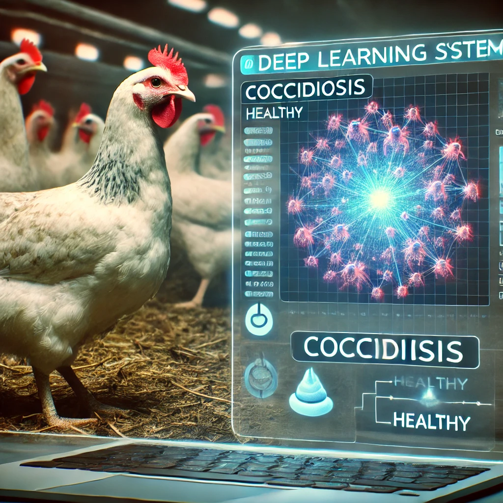

# Chicken Disease Classification: Coccidiosis Detection



## Description
This project is a deep learning-based classifier designed to detect **Coccidiosis disease** from chicken fecal images. The project uses a modular coding approach and is implemented in Python. It leverages a trained deep learning model to classify images, identifying whether the chickens are infected with Coccidiosis.

The project pipeline is tracked using **DVC (Data Version Control)**, and the deployment is handled through a **Flask** web application.

## Table of Contents
1. [Installation](#installation)
2. [Usage](#usage)
3. [Pipeline (DVC)](#pipeline-dvc)
4. [Deployment](#deployment)
5. [Contributing](#contributing)
6. [License](#license)
7. [Contact](#contact)

## Installation

### Prerequisites
Make sure you have the following installed:
- Python 3.8+
- Virtual environment setup (optional but recommended)
- DVC
- Flask

### Steps

1. **Clone the repository:**
   ```bash
   git clone https://github.com/yourusername/chicken-disease-classification.git
   cd chicken-disease-classification
   ```

2. **Create and activate a virtual environment (optional but recommended):**
   ```bash
   python3 -m venv venv
   source venv/bin/activate  # On Windows: venv\Scripts\activate
   ```

3. **Install the required dependencies:**
   ```bash
   pip install -r requirements.txt
   ```

4. **Setup DVC:**
   ```bash
   dvc pull
   ```

## Usage

### Running the Classification
To run the model and classify new chicken fecal images:

1. Place the images in the `data/input` folder.
2. Run the Python script:
   ```bash
   python src/classify_images.py
   ```
   This will output the classification results in the terminal.

### Flask Web Application
To run the web app:

1. Ensure you are in the correct directory where the `app.py` is located.
2. Run the Flask app:
   ```bash
   flask run
   ```
3. Visit `http://127.0.0.1:5000/` in your browser, upload images, and get predictions directly from the web interface.

## Pipeline (DVC)
The project pipeline is managed using **DVC** to ensure smooth and reproducible training and model building.

1. **Check the pipeline stages:**
   ```bash
   dvc dag
   ```
2. **Run the pipeline:**
   ```bash
   dvc repro
   ```

## Deployment
The model is deployed using Flask for a web-based interface where users can upload fecal images and get instant classification results.

## Contributing
If you would like to contribute to the project, follow these steps:

1. Fork the repository.
2. Create a new branch:
   ```bash
   git checkout -b feature-branch
   ```
3. Make your changes and commit them:
   ```bash
   git commit -m "Add new feature"
   ```
4. Push to the branch:
   ```bash
   git push origin feature-branch
   ```
5. Submit a pull request.

## License
This project is licensed under the MIT License - see the [LICENSE](LICENSE) file for details.

